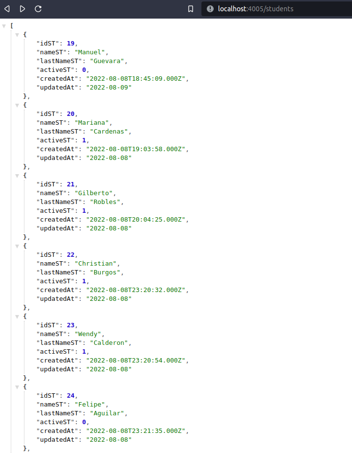
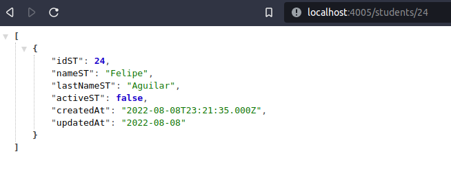

# (CRUD) Student regitration - Node

This is the back-end build of Student registration CRUD; the project register, modify, and delete data from students in the DB

## The challenge ✅

API should be able to:

- Send responses to the API requests
- GET data from a table in a MySQL DB
- GET a single object in the DB
- POST, PUT, DELETE new data in the DB

## Screenshots 📸

- ### API response
  
- ### APO response
  

## Links 🔗

- Repo: [Github](https://github.com/RicAlc/students-crud-node)
- Site URL: in progress
- Full CRUD project repo: [Github](https://github.com/RicAlc/students-crud)

## Built with 🧰 🛠️

- NodeJS
- Express
- Cors
- MySQL2
- Sequelize

## Author 🧑🏽‍💻

- Github - [Ricardo Alcalá](https://www.github.com/RicAlc)
- Twitter - [@\_RicAlc](https://twitter.com/_RicAlc)
